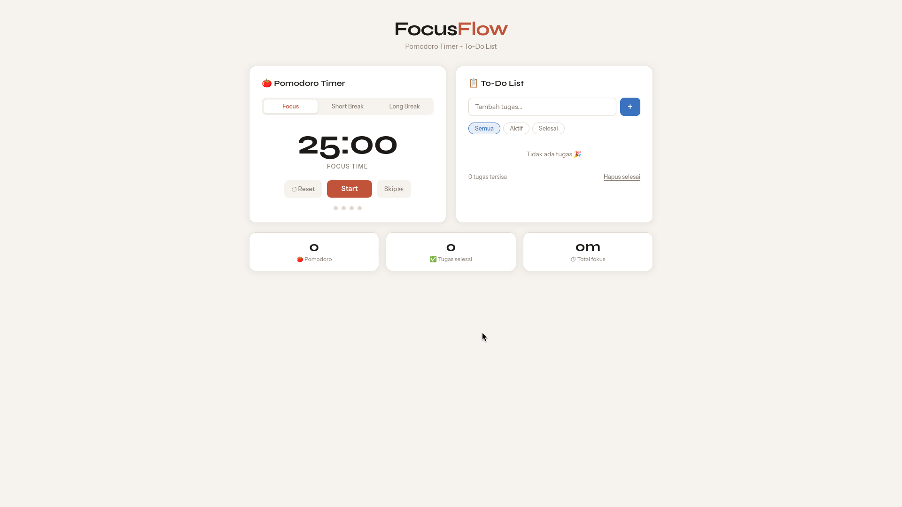

# 🍅 FocusFlow — Pomodoro + To-Do App

Aplikasi produktivitas sederhana berbasis **HTML, CSS, dan JavaScript murni** (tanpa framework).  
Dibuat sebagai project latihan level intermediate.

---

## ✨ Fitur

- **Pomodoro Timer** — focus 25 menit, short break 5 menit, long break 15 menit
- **Session Tracker** — 4 dot yang mewakili 1 putaran pomodoro
- **To-Do List** — tambah, centang, hapus tugas; tersimpan otomatis
- **Filter Tugas** — tampilkan semua / aktif / selesai
- **Stats Bar** — jumlah pomodoro, tugas selesai, total menit fokus
- **Toast Notification** — notifikasi kecil setiap ada aksi

---

## 📁 Struktur File

```
focusflow/
├── index.html        # Struktur halaman
├── css/
│   └── style.css     # Semua styling
└── js/
    ├── stats.js      # Variabel global & fungsi toast (load pertama)
    ├── pomodoro.js   # Logika timer pomodoro
    └── todo.js       # Logika to-do list
```

> **Urutan load JS penting!**  
> `stats.js` harus dimuat duluan karena berisi variabel yang dipakai file lain.

---

## 🚀 Cara Pakai

1. Clone repo ini
```bash
git clone https://github.com/username/focusflow.git
```

2. Buka `index.html` langsung di browser — tidak perlu server.

---

## 🛠 Teknologi

| Teknologi | Kegunaan |
|-----------|----------|
| HTML5 | Struktur halaman |
| CSS3 | Styling & layout (Grid, Flexbox, CSS Variables) |
| JavaScript (ES6) | Logika aplikasi |
| localStorage | Menyimpan data todo |

---

## 📚 Konsep JS yang Dipelajari

- `setInterval` & `clearInterval` untuk timer
- Array method: `.find()`, `.filter()`, `.forEach()`
- `localStorage` untuk menyimpan data
- DOM manipulation: `createElement`, `innerHTML`, `classList`
- Event listeners: `click`, `keydown`

---

## 🖼 Preview



---

Made with ☕ as a learning project.
